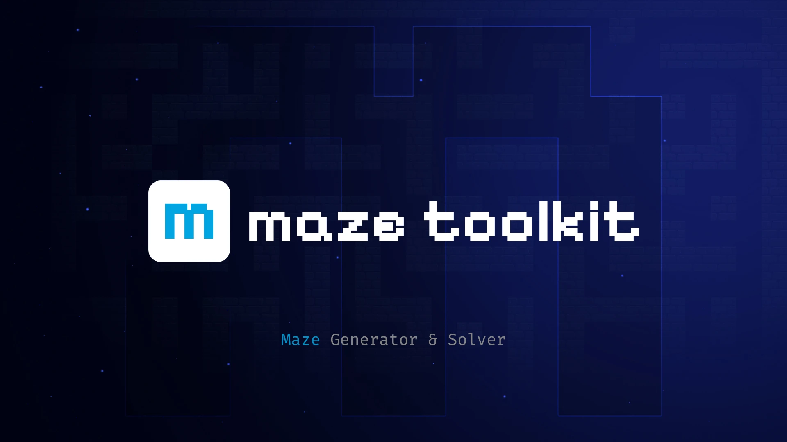

# Maze Toolkit
Tool for generating and solving mazes using C++. This project is compiled to WebAssembly with Emscripten for web-based interaction.

  

## Summary 📋

  
Summary

- Features
- Algorithms
- References
  

## Features 🌟

- **Maze Generation**: Choose from several popular algorithms to generate mazes.
- **Maze Solving**: Solve generated or custom mazes using efficient search algorithms.
- **Custom Maze Creation**: Create your own mazes with an interactive web-based editor.
- **Web Interface**: A user-friendly web interface for generating, solving, and designing mazes.

## Algorithms 🤖
### Generation Algorithms:

- Randomized Depth First
- Kruskal
- Wilson
- Recursive Division
- Binary Tree
- Side Winder

### Solving Algorithms:

- Breadth First
- Bidirectional BF
- A*

## References 📚

Here are some resources that inspired and informed the development of this project:

- [Maze Generation Algorithms](https://weblog.jamisbuck.org/2011/2/7/maze-generation-algorithm-recap) - A description of various algorithms for generating mazes.
- [Emscripten Documentation](https://developer.mozilla.org/en-US/docs/WebAssembly/C_to_Wasm) - The official documentation for compiling C++ to WebAssembly.
- [Algo Visualizers by Sadanand Pai](https://sadanandpai.github.io/algo-visualizers/#/path-finder/) - Inspired the design and functionality of the maze generation interface.
  
 

  

